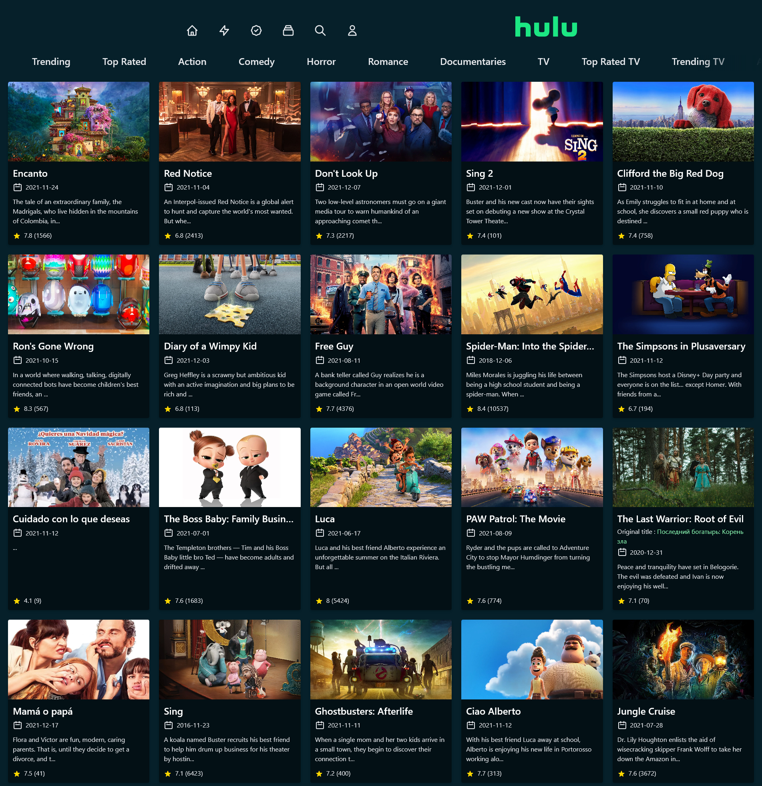
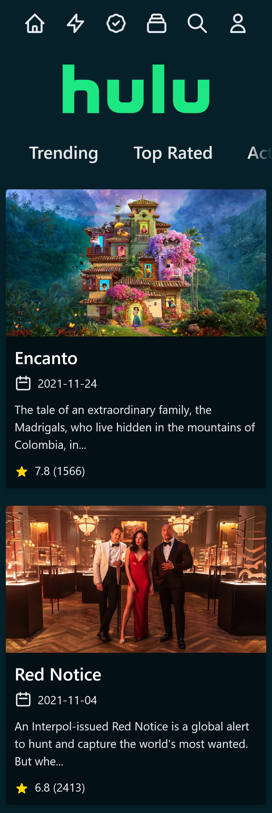

# My 1st Next.js Project (Hulu Clone)

### Here Are Some Screenshots

## Desktops

### Home Screen

## Mobile

# My Learnings
1) How get Server-Sides props
2) Use new Tailwind CSS jit mode (like bounce animation, jit css properties)
3) How go about Mobile first development approach (i used to do desktop first approach)

